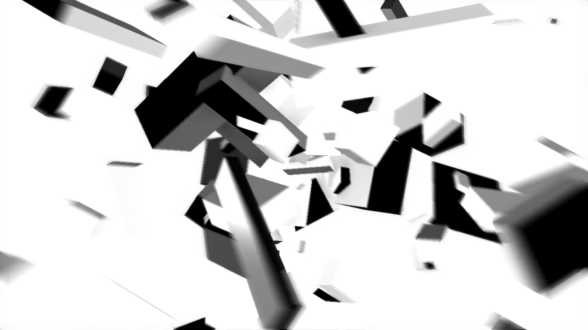

# TD-MotionBlur

A TouchDesigner motion blur prototype based on velocity reconstruction with optional TileMax/NeighborMax support.

## References

- McGuire et al., *A Reconstruction Filter for Plausible Motion Blur* (I3D 2012)  
  http://graphics.cs.williams.edu/papers/MotionBlurI3D12/
- Guertin et al., *A Fast and Stable Feature-Aware Motion Blur Filter* (NVIDIA, 2013)
  https://research.nvidia.com/publication/2013-11_fast-and-stable-feature-aware-motion-blur-filter
- hanasaan, *ofxMotionBlurCamera*  
  https://github.com/hanasaan/ofxMotionBlurCamera/

## License

This project is released under the MIT License.
